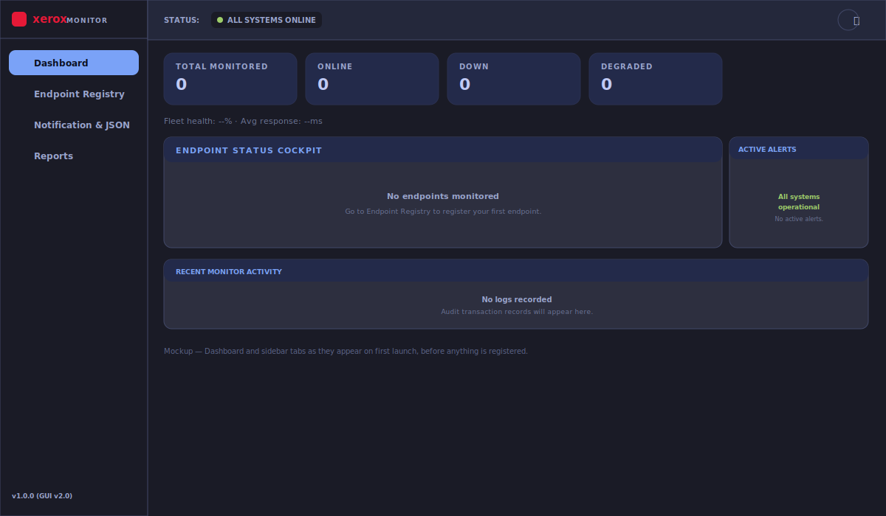
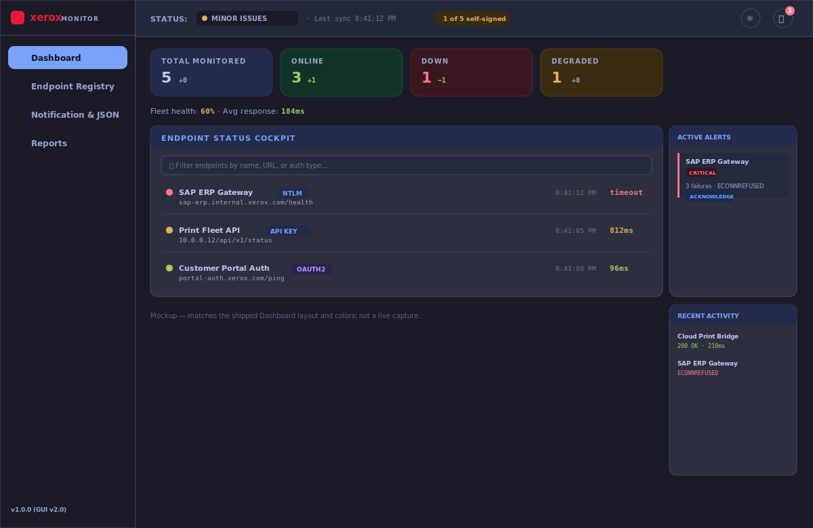
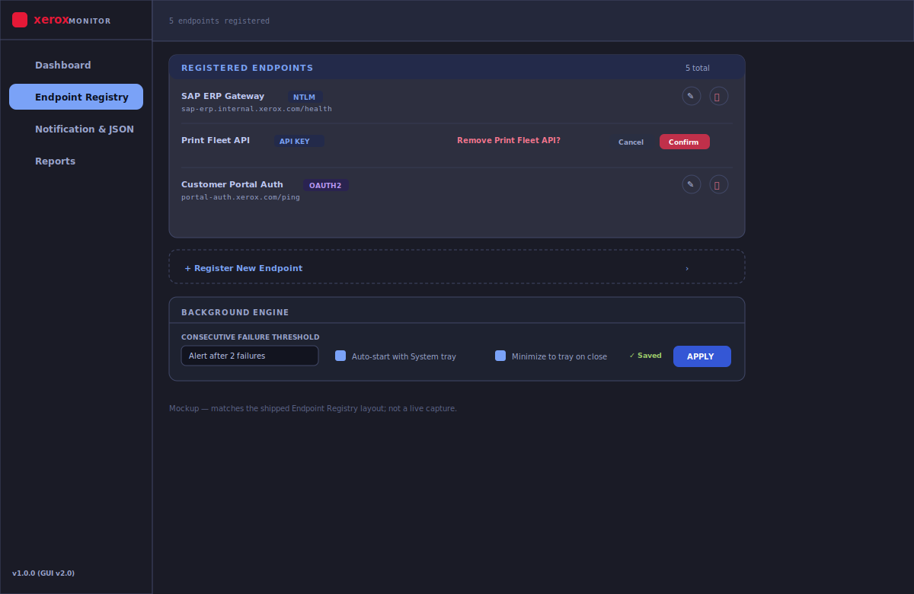
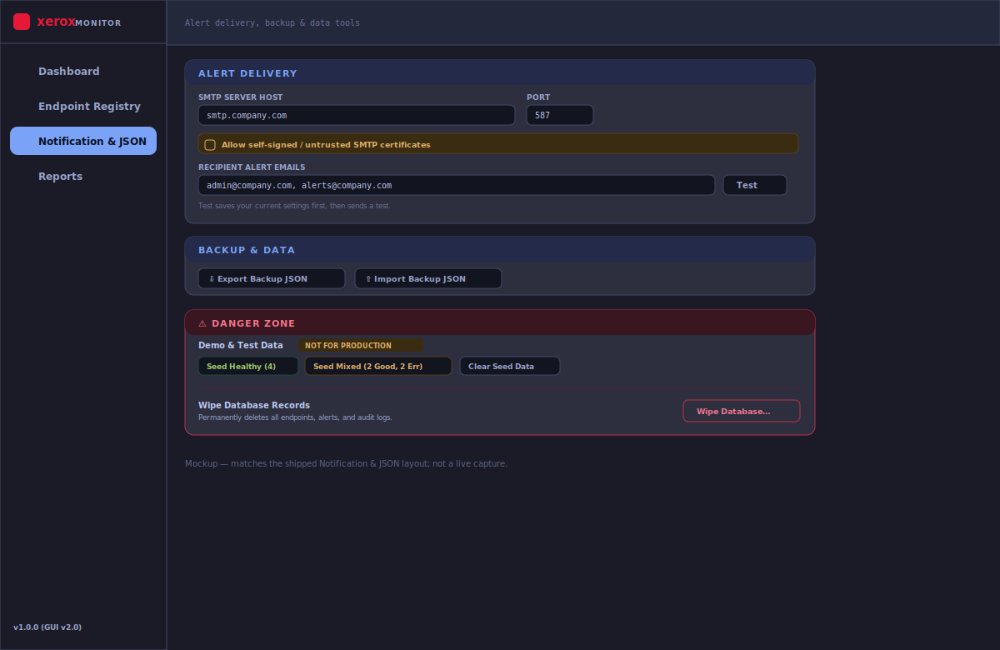
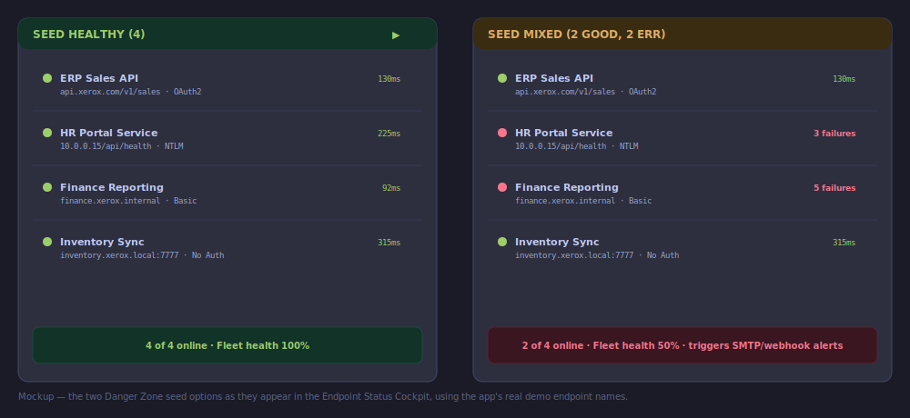
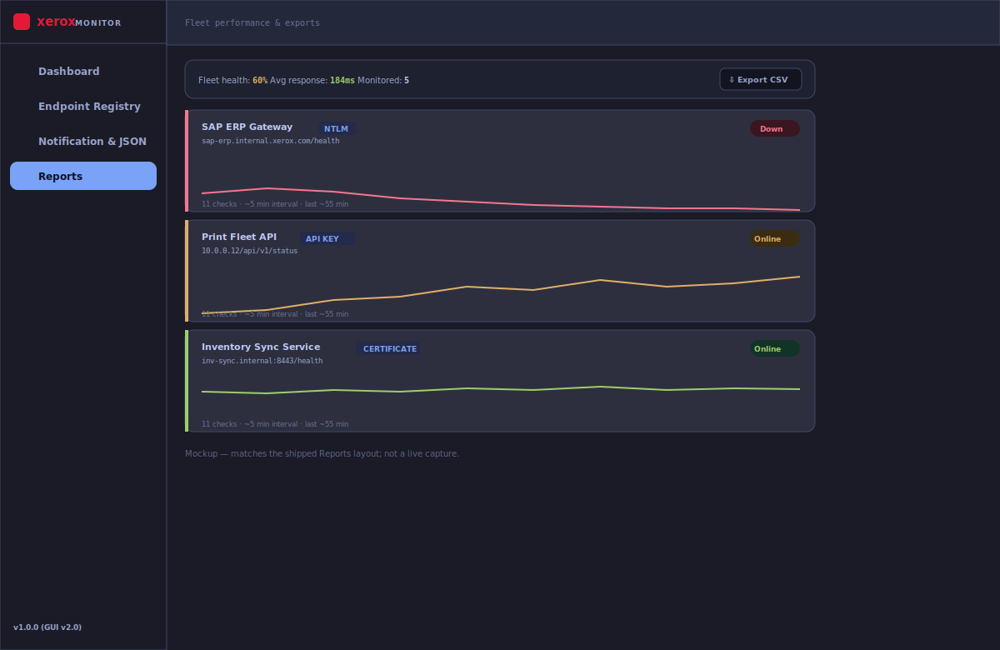

# Xerox API Monitor — How-To Guide

  

| | |
|---|---|
| **Author** | Harry Joseph |
| **App Version** | 1.2.0 (GUI v2.0) |
| **Date** | July 9, 2026 |
| **Scope** | A practical, screen-by-screen walkthrough of the current GUI |

This guide walks through the four tabs of the app exactly as they exist today, control by control. For authentication method setup, SMTP/webhook configuration details, and troubleshooting, see [UserManual.md](UserManual.md) — this document is the quick "what does this button do" reference.

---

## Table of Contents
1. [First Launch](#1-first-launch)
2. [The Header Bar](#2-the-header-bar)
3. [Dashboard](#3-dashboard)
4. [Endpoint Registry](#4-endpoint-registry)
5. [Notification & JSON](#5-notification--json)
6. [Reports](#6-reports)
7. [Quick Reference Table](#7-quick-reference-table)

---

## 1. First Launch

*Mockup — the Dashboard and sidebar tabs exactly as they appear on first launch, before anything is registered. Not a live screen capture.*

The app opens on the **Dashboard** tab with an empty state until you register your first endpoint. Use the left sidebar to move between the four tabs:

* **Dashboard** — live status, alerts, and activity
* **Endpoint Registry** — add, edit, and remove monitored endpoints
* **Notification & JSON** — alert delivery, backup/restore, and admin tools
* **Reports** — per-endpoint performance history and CSV export

The sidebar footer shows the installed version. The app defaults to the **Tokyo Night** dark theme.

---

## 2. The Header Bar

| Control | What it does |
|---|---|
| **Status pill** | One glance at fleet health: *All Systems Online* (green), *Minor Issues* (yellow), or *Critical Outages* (red) — computed from your actual endpoints, not a static label. |
| **Last sync** | Timestamp of the most recent check across all endpoints. |
| **TLS pill** | *TLS Verified* if every endpoint validates certificates strictly, or *N of M allow self-signed* if any endpoint has "Accept self-signed certificates" enabled. This reflects real per-endpoint settings — it does not just claim security is on. |
| **Theme toggle** (sun/moon icon) | Switches between **White** and **Tokyo Night**. Your choice is remembered between launches. |
| **Bell icon** | Click to open a dropdown of your most recent unread alerts. Click any alert in the dropdown to acknowledge it directly — no need to go to the Dashboard. The red badge count reflects unread alerts only. |

---

## 3. Dashboard

*Mockup drawn to match the shipped layout and Tokyo Night color values — not a live screen capture.*

### KPI cards (top row)
Four cards — **Total Monitored**, **Online**, **Down**, **Degraded** — each showing the current count plus a small colored delta (e.g. `+1`, `−1`) comparing against roughly 15 minutes ago, so you can tell at a glance whether things are trending better or worse.

### Fleet health strip
Just below the cards: **Fleet health** (percentage of endpoints currently online) and **Avg response** (mean of the latest latency per endpoint), both colored by threshold — green/amber/red — so a problem is visible without reading the numbers.

### Endpoint Status Cockpit
* **Filter box** — type any part of a name, URL, or auth method (e.g. `ntlm`, `sap`, `10.0.0`) to narrow the list instantly.
* **Sort order** — failing endpoints always sort to the top, then idle, then healthy — the ones needing attention are never buried below a long list of healthy ones.
* Each row shows: status dot, name, **auth-method tag** (API Key / NTLM / Certificate / OAuth2 / Basic / Cookie), full URL, a small **sparkline** of recent response times colored by current status, last-check time, the latest latency (colored green/amber/red by the same thresholds as the fleet strip), and a **Check** button to trigger an immediate re-check outside the normal schedule.

### Active Alerts Feed
Every unread alert shows the endpoint name, a **Critical** severity chip, the failure message, and a timestamp. Click **Acknowledge** to mark it read — it disappears from this feed and from the header bell's unread count.

### Recent Monitor Activity
A rolling feed of the latest check results (not just failures) — successful checks in green, failures in red. Click any row to copy its message to the clipboard (a small toast confirms the copy).

---

## 4. Endpoint Registry

*Mockup drawn to match the shipped layout and Tokyo Night color values — not a live screen capture.*

### Registered Endpoints
The list of everything currently monitored leads the page, since most visits here are to review or adjust an existing endpoint rather than add a new one. Each row shows the name, URL, and auth tag, plus:

* **Pencil icon** — opens an inline edit form pre-filled with that endpoint's current settings. Change anything (name, URL, interval, timeout, auth, self-signed cert option) and click **Save Changes**.
* **Trash icon** — asks for confirmation before deleting ("Remove *name*?" with Cancel/Confirm) rather than deleting instantly.

### Register New Endpoint
Collapsed by default — click the dashed **Register New Endpoint** row to expand the form. Fill in:

1. **Endpoint Name** and **URL**
2. **Check Interval** and **Timeout**
3. **Authentication Method** (see [UserManual.md § 4](UserManual.md#4-authentication-guide) for details on each type)
4. **Accept self-signed certificates**, only for internal HTTPS endpoints with a private CA

Click **Test Connection** to verify before saving, then **Add Endpoint** to register it. The form closes automatically after a successful save (or edit).

### Best Practices for Registering Endpoints

**Naming** — use a consistent `System_Purpose` scheme (`SAP_Sales_API`, `HR_Portal_Health`, `Print_Fleet_Status`) so the list stays scannable once you have more than a handful of endpoints. Avoid generic names like `API 1`.

**URL** — always use the fully-qualified internal address (`127.0.0.1`, an internal DNS name, or a `192.168.x.x` IP). This is the whole point of a desktop monitor: it can reach addresses a browser-based tool never could.

**Check Interval** — the dropdown offers `1, 2, 5, 10, 15, 30, 60` minutes. Match it to how critical the endpoint is:

| Endpoint type | Recommended interval |
|---|---|
| Critical production API | **1–2 min** |
| Standard internal service | **5 min** ← default, recommended for most endpoints |
| Low-priority / rarely-changing endpoint | **15–30 min** |
| Rarely-used / archival system | 60 min |

Shorter intervals catch outages faster but generate more check traffic and more log volume — don't set everything to 1 minute by default. **5 minutes is the right starting point for anything you're not sure about.**

**Timeout** — the dropdown offers `5, 10, 15, 30, 60, 120` seconds.

| Endpoint type | Recommended timeout |
|---|---|
| Fast internal REST API | 5 sec |
| Typical internal API | **10 sec** ← default, recommended for most endpoints |
| Known-slow / legacy system | 30–60 sec |
| Batch/report-generation endpoint | 120 sec |

If a normally-working endpoint keeps reporting failures, raise the timeout before assuming the service is actually down.

**Authentication method** — pick the one the server actually enforces (full details per type in [UserManual.md § 4](UserManual.md#4-authentication-guide)):
* Prefer **API Key** or **OAuth2** over **Basic Auth** wherever the server supports it.
* Use **NTLM** only for internal Windows-domain-protected portals.
* Use **Certificate (mTLS)** when the server requires a client-certificate handshake.

**Self-signed certificates** — only enable "Accept self-signed / internal TLS certificates" for endpoints on your own internal CA. Never enable it for public or externally-trusted endpoints; strict SSL validation is the default for a reason.

**Always Test Connection before saving** — it catches a bad URL, wrong credentials, or an unreachable host immediately, instead of waiting for the first scheduled check to fail.

**Tune the failure threshold to match the endpoint** — if an endpoint is known to have brief transient blips, pair its short check interval with a slightly higher **Consecutive Failure Threshold** (Background Engine, below) so a single blip doesn't fire an alert.

### Background Engine
* **Consecutive Failure Threshold** — how many failed checks in a row before an alert fires (default: 2).
* **Auto-start with System tray** / **Minimize to tray on close** — startup and window-close behavior.
* **Apply** — saves these two settings; a green "Saved" confirmation appears briefly next to the button.

---

## 5. Notification & JSON

*Mockup drawn to match the shipped layout and Tokyo Night color values — not a live screen capture.*

### Alert Delivery
SMTP server/port/credentials, the **self-signed SMTP certificate** option (for internal mail relays), recipient email addresses, and the chat webhook (Teams/Discord/Slack) — each with a **Test** button. Both Test buttons save your current form values first, then send a real test message; the field caption says so.

Below that: native OS notifications, launch-at-startup, auto-updates, **Maintenance Mode** (pauses all monitoring — bold red text since it's an easy setting to forget you've turned on), and weekly CSV auto-export with a folder path. **Save Settings** persists everything in this panel.

#### Setting up SMTP email alerts

| Provider | Server | Port | Notes |
|---|---|---|---|
| Gmail | `smtp.gmail.com` | 587 | Requires an **App Password**, not your normal Google password, if 2FA is enabled |
| Microsoft 365 / Outlook | `smtp.office365.com` | 587 | Use your normal mailbox credentials |
| Internal corporate relay | ask your IT team | usually 25 or 587 | If it uses an internal CA certificate, check **"Allow self-signed / untrusted SMTP certificates"** |

Steps:
1. Go to **Notification & JSON → Alert Delivery**.
2. Enter **SMTP Server Host** and **Port** from the table above.
3. Enter **SMTP Username** / **Password** (the App Password for Gmail).
4. Enter one or more **Recipient Alert Emails**, comma-separated.
5. Click **Test** next to the email field — this saves your settings and sends a real test email to confirm delivery.
6. Click **Save Settings** to persist.

#### Setting up Teams / Discord / Slack alerts

| Provider | Where to get the webhook URL |
|---|---|
| **Microsoft Teams** | In the target channel: `···` → **Connectors** → **Incoming Webhook** → **Configure** → copy the generated URL |
| **Discord** | Channel **Settings** → **Integrations** → **Webhooks** → **New Webhook** → **Copy Webhook URL** |
| **Slack** | Add the **Incoming Webhooks** app to your workspace → choose a channel → copy the generated webhook URL |

Steps:
1. Go to **Notification & JSON → Alert Delivery**.
2. Set **Channel Type** to match your provider.
3. Paste the **Chat Webhook URL** from the table above.
4. Click **Test** — sends a simulated alert card so you can confirm it lands in the right channel.
5. Click **Save Settings** to persist.

> Both webhook and SMTP fields only accept `https://` URLs and validated SMTP hosts — this is enforced to prevent alerts leaking to an unintended or insecure destination.

### Backup & Data
* **Export Backup JSON** — downloads a full snapshot of your endpoints, logs, and settings.
* **Import Backup JSON** — restores from a previously exported file.

### Danger Zone
Visually separated (red-bordered panel) from routine settings, because these three actions are either synthetic or irreversible:

* **Seed Healthy (4)** / **Seed Mixed (2 Good, 2 Err)** — injects fake demo endpoints to preview how alerts/colors look, clearly labeled "not for production endpoints." Does not touch your real monitors.
* **Clear Seed Data** — removes only the demo endpoints created above.
* **Wipe Database Records** — permanently deletes all real endpoints, alerts, and logs. Requires typing `DELETE` into a confirmation dialog before it will proceed.

#### What each seed option actually creates

*Mockup — the four real demo endpoints the app seeds, shown in both outcomes. Not a live screen capture.*

Both options seed the same four demo endpoints (`ERP Sales API`, `HR Portal Service`, `Finance Reporting`, `Inventory Sync`) — only the status of the middle two changes:

| | ERP Sales API | HR Portal Service | Finance Reporting | Inventory Sync |
|---|---|---|---|---|
| **Seed Healthy (4)** | ✅ Online | ✅ Online | ✅ Online | ✅ Online |
| **Seed Mixed (2 Good, 2 Err)** | ✅ Online | ❌ Down (3 failures) | ❌ Down (5 failures) | ✅ Online |

Use **Seed Healthy** to confirm the dashboard renders a fully green fleet correctly. Use **Seed Mixed** to see the failure states, alert feed, and outbound SMTP/webhook notifications actually fire — it's the one to use when testing your alert configuration end-to-end. Click **Clear Seed Data** afterward to remove both demo sets before registering real endpoints.

---

## 6. Reports

*Mockup drawn to match the shipped layout and Tokyo Night color values — not a live screen capture.*

### Summary strip
**Fleet health**, **Avg response**, and total **Monitored** count — the same figures as the Dashboard's fleet strip, so the two screens never disagree — plus an **Export CSV** button that downloads your full log history as a `.csv` file on demand (separate from the recurring weekly auto-export configured in Notification & JSON).

### Per-endpoint cards
Each registered endpoint gets its own card:

* Left border colored by current status (green online / red down / grey idle)
* Name, URL, auth tag, and a status pill (**Online** / **Down** / **Idle**)
* A latency trace chart with peak value, plus a caption stating exactly how much time the trace covers (check count × interval), instead of an unlabeled "10-point trace"
* A **Current Status** panel describing the most recent check result — this intentionally does not show a fabricated uptime percentage, since only the last 10 response times are stored, not a time-bounded success history

---

## 7. Quick Reference Table

| I want to... | Go to |
|---|---|
| See what's failing right now | Dashboard → Endpoint Status Cockpit (failures sort to top) |
| Add a new endpoint | Endpoint Registry → Register New Endpoint |
| Change an endpoint's settings | Endpoint Registry → pencil icon on that row |
| Stop monitoring an endpoint | Endpoint Registry → trash icon → Confirm |
| Clear an alert | Dashboard → Acknowledge, or header bell dropdown |
| Send a test email or Teams/Slack message | Notification & JSON → Alert Delivery → Test |
| Pause all monitoring temporarily | Notification & JSON → Maintenance Mode |
| Back up my configuration | Notification & JSON → Export Backup JSON |
| Wipe everything and start fresh | Notification & JSON → Danger Zone → Wipe Database |
| Export logs as CSV right now | Reports → Export CSV |
| See response-time history for one endpoint | Reports → that endpoint's card |
| Switch between light/dark theme | Header → sun/moon icon |

---

For authentication setup details, SMTP/webhook provider instructions, backup file locations, system tray behavior, and troubleshooting/FAQ, see the full [UserManual.md](UserManual.md).
