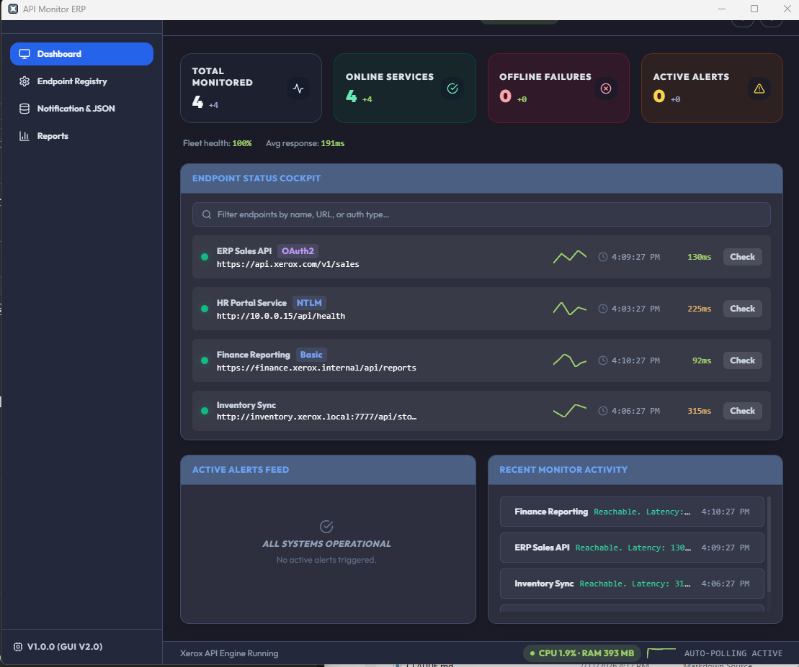
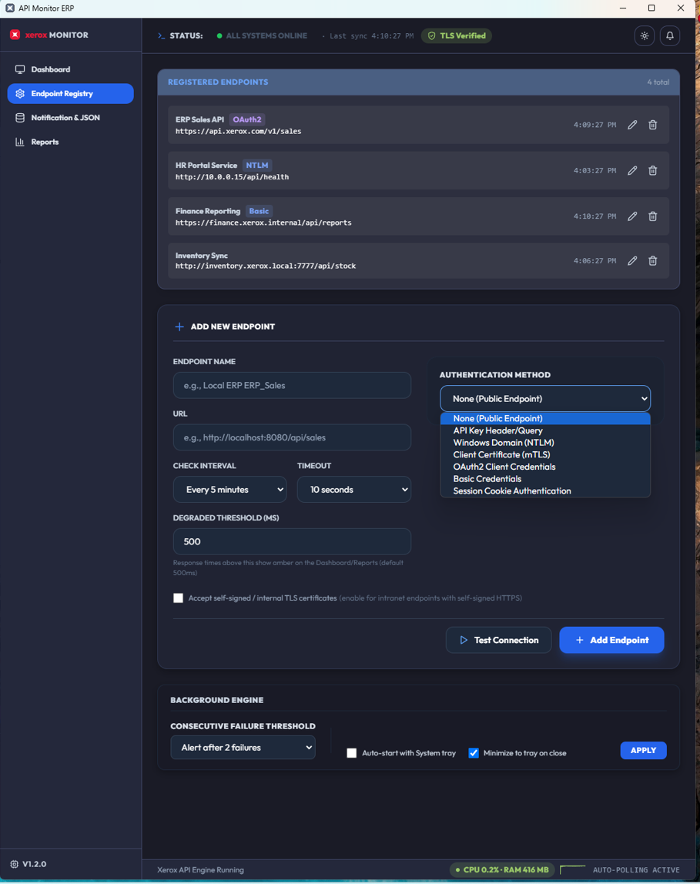
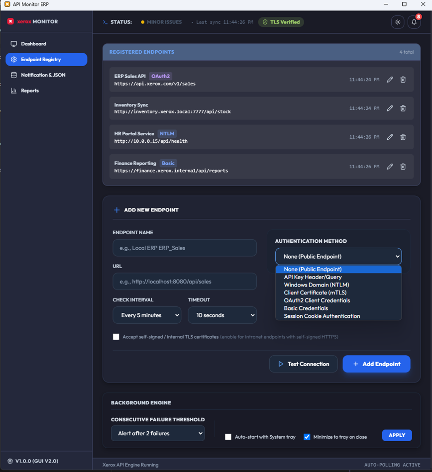
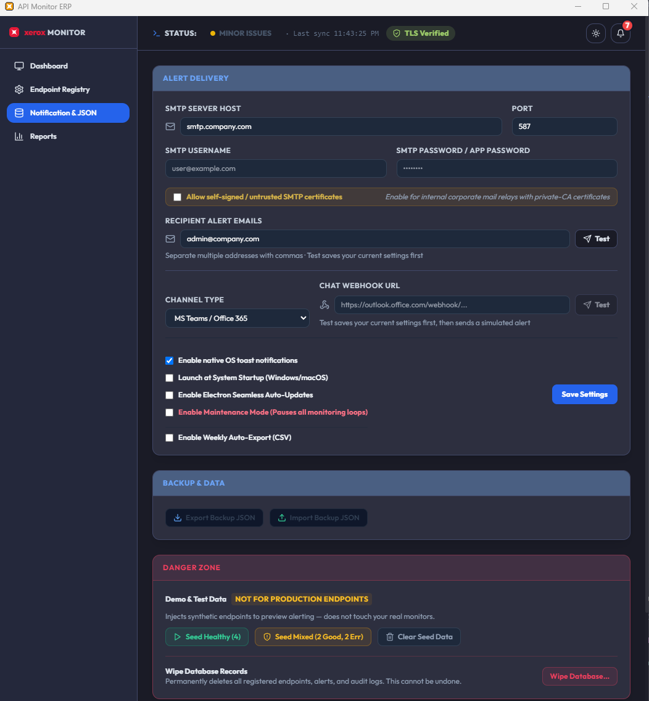
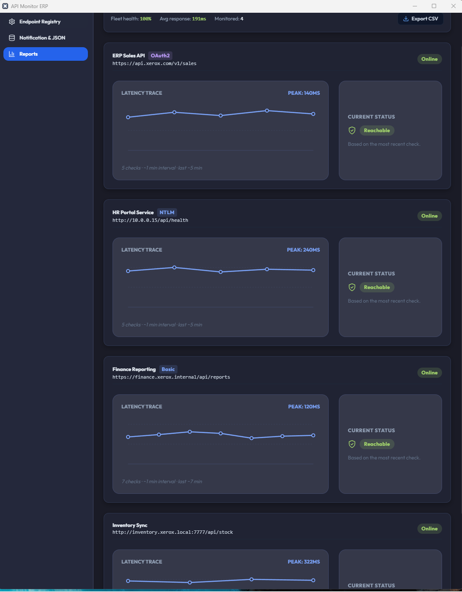

# Xerox API Monitor ERP Desktop

<p><strong>Author:</strong> Harry Joseph | <strong>Date:</strong> July 11, 2026</p>

<div align="center">
  

  [](#release-and-quality)
  [](#at-a-glance)
  [](LICENSE)
  [](#technology-stack)
</div>

A native Windows desktop application for 24/7 monitoring of internal ERP and business API endpoints.

**Validate an endpoint once, monitor it forever**: the same probe you test is the probe that runs continuously afterward, so tested and watched never drift apart.

Unlike browser-only or Docker-first uptime tools, this product is optimized for real enterprise network conditions: localhost services, intranet endpoints, and authentication-heavy APIs.

---

## Table of Contents

- [Executive Brief](#executive-brief)
- [At a Glance](#at-a-glance)
- [Who This Is For](#who-this-is-for)
- [What You Get](#what-you-get)
- [Core Workflow: Validate Then Monitor](#core-workflow-validate-then-monitor)
- [Why It Is Different](#why-it-is-different)
- [Authentication Coverage](#authentication-coverage)
- [Reliability and Security Highlights](#reliability-and-security-highlights)
- [Design Principles](#design-principles)
- [Operational Features](#operational-features)
- [Performance: Connection Reuse](#performance-connection-reuse)
- [Visual Walkthrough](#visual-walkthrough)
- [Competitive Research and Positioning](#competitive-research-and-positioning)
- [Sales Pitch (Reuse Ready)](#sales-pitch-reuse-ready)
- [Roadmap](#roadmap)
- [Technology Stack](#technology-stack)
- [Repository Layout](#repository-layout)
- [Release and Quality](#release-and-quality)

---

## Executive Brief

If you read one section, read this.

API Monitor ERP Desktop is a Windows-native monitoring product built for internal enterprise APIs where generic uptime tools often fail in practice.

### Why It Matters to Leadership

| Executive Concern | What This Product Delivers |
|---|---|
| Service continuity risk | 24/7 tray-resident monitoring with alerting on state transitions |
| Integration outage cost | Validate and monitor the same probe to prevent test/monitor config drift |
| Enterprise auth complexity | Support for NTLM, mTLS, OAuth2, Basic, API key, and cookie-session patterns |
| Operational overhead | No mandatory Docker stack or cloud dependency for core operation |
| Roadmap fit | Future-ready customization path for M-Files Vault workflow add-on integration |

### 30-Second Decision Snapshot

1. Choose this product when endpoints are internal, auth-heavy, and Windows-operational.
2. Choose this product when teams need fast adoption without container infrastructure.
3. Choose this product when test accuracy must match continuous monitoring behavior.
4. Choose this product when you need to confirm an endpoint is valid quickly, without opening a separate testing tool.

---

## At a Glance

| Item | Details |
|---|---|
| Product | Xerox API Monitor ERP Desktop |
| Author | Harry Joseph |
| Date | July 11, 2026 |
| Purpose | Monitor internal and external HTTP/HTTPS APIs with enterprise authentication |
| Installer Size | ~80 MB Windows installer |
| Runtime Model | Native Windows app running 24/7 in system tray |
| Primary Audience | IT Operations, SysAdmins, Integration Engineers, Compliance teams |
| Local Storage | `better-sqlite3` + encrypted settings in AppData |
| Deployment Style | No mandatory cloud, no mandatory Docker |

---

## Who This Is For

| Role | Outcome |
|---|---|
| IT Operations | Early warning when internal services degrade or fail |
| System Administrators | Always-on tray monitoring with webhook and SMTP alerts |
| Integration Engineers | Validate auth flows (NTLM, OAuth2, mTLS, cookie sessions) before production incidents |
| Compliance Teams | Structured logs, export capability, and bounded retention behavior |

---

## What You Get

| Capability | Delivered Value |
|---|---|
| Endpoint Monitoring | Recurring checks with per-endpoint intervals and timeout controls |
| Enterprise Auth | API Key, NTLM, mTLS certs, OAuth2 client credentials, Basic, Session Cookie |
| Alerting | Native notifications, SMTP email, and webhook channels |
| Tray Operations | Background checks continue with tray controls and quick actions |
| Reporting | Latency trends, status snapshots, and CSV export support |
| Data Safety | Input validation, bounded reads, and hardened settings handling |
| Demo Experience | Seed data modes for fast UI and alert workflow demonstrations |

---

## Core Workflow: Validate Then Monitor

This product is built around one workflow:

1. Configure endpoint details and authentication.
2. Use Test Connection to validate status code, elapsed time, and response behavior.
3. Save the endpoint.
4. The same probe is monitored continuously on schedule.

Result: no copy-paste between "test tool" and "monitoring tool," and no config drift between validated and monitored behavior.

---

## Why It Is Different

Most lightweight open-source monitors are excellent at generic uptime checks. This product is purpose-built for internal ERP monitoring realities.

**Postman validates but doesn't watch; generic monitors watch but never validated — API_Monitor does both with the same probe.**

1. Desktop-first architecture for Windows operations teams.
2. Direct monitoring of localhost and intranet endpoints from a native runtime.
3. Multi-auth support in one application, including NTLM and cookie session flows.
4. Security-focused defaults for long-running background operation.
5. Practical UX for non-developer operators.
6. No mandatory container stack or cloud dependency.
7. Future-ready for M-Files Vault integration: customizable to update API endpoints directly in the M-Files Vault workflows add-on.

---

## Authentication Coverage

| Authentication Type | Supported | Notes |
|---|---|---|
| None/Public | Yes | Baseline health checks |
| API Key (Header/Query) | Yes | Per-endpoint config |
| Windows Auth (NTLM) | Yes | Domain credential flow via `axios-ntlm` |
| Client Certificate (mTLS) | Yes | PFX/P12 with passphrase validation |
| OAuth2 Client Credentials | Yes | Token caching and refresh behavior |
| Basic Authentication | Yes | Header-based credential flow |
| Session Cookie Login | Yes | Cookie jar session with expiry-driven re-login |

---

## Reliability and Security Highlights

- Single-instance enforcement to prevent duplicate background monitors.
- Event-driven state updates for tray and UI sync.
- Request deduplication to avoid redundant overlapping calls.
- Secure-by-default TLS verification with explicit per-endpoint opt-in for self-signed cases.
- Alert burst protection to reduce outage notification spam.
- Encrypted credential persistence with Windows DPAPI (`safeStorage`).
- Webhook SSRF protections for outbound URLs.
- Typed settings boundary validation and bounded log retrieval behavior.
- Hourly heartbeat log entry — a receipt proving the engine was alive and monitoring overnight and on weekends, not just a claim.

---

## Built for Enterprise Networks

### AD Lockout Protection

Repeatedly failing NTLM or Basic-auth checks against a domain-joined service can trip Active Directory's own account lockout policy — the monitor itself becomes the outage. API Monitor ERP Desktop's circuit breaker detects a 401/403 on an NTLM or Basic-authenticated endpoint, halts that endpoint's automatic checks immediately, and surfaces a distinct "Paused — Auth Lockout" status instead of silently continuing to hammer the credential. Checks resume automatically on the next manual recheck or endpoint re-save.

This protects the customer's own Active Directory infrastructure from the monitor, not just the monitor from the network — no generic uptime tool in the comparison tables below has an equivalent safeguard.

---

## Design Principles

1. One endpoint equals one probe and one source of truth for status, history, and alerts.
2. Monitoring is read-only and does not mutate monitored systems.
3. On restart, statuses reset to a clean pending state and all endpoints are re-verified in a staggered sweep; history persists, and gaps are shown as no-data rather than a false status.

---

## Operational Features

### Background Operations

- Start at login support.
- Minimize-to-tray behavior.
- Maintenance mode for planned outages.
- Manual check-all and per-endpoint test flows.

### Data and Storage

- Database: `C:\Users\<Username>\AppData\Roaming\api-monitor-erp\api_monitor.db`
- Settings: `C:\Users\<Username>\AppData\Roaming\api-monitor-erp\config.json`
- Optional CSV export for reporting and audits.

### Error Visibility

The monitoring engine surfaces the underlying error for fast operational diagnosis — including TLS-specific codes such as `CERT_HAS_EXPIRED`, connection-level failures, and 4xx/5xx status responses.

---

## Performance: Connection Reuse

The monitoring engine uses persistent keep-alive connections and endpoint-level agent caching.

This is especially important for NTLM, where authentication binds to the connection rather than a single request.

| Behavior | Shared Keep-Alive Agent (Current) |
|---|---|
| TCP connections (6 probes) | 1 persistent connection |
| Connection pattern | Reused established connection |
| NTLM handshake cost | Handshake reused for connection lifetime |

Implementation note: agents are cached per endpoint (`agentCache` in `electron/monitoring.ts`) and evicted when an endpoint is edited or deleted, so updates take effect on the next check.

---

## Visual Walkthrough

### Dashboard



Status summary, endpoint health, active alerts, and recent activity feed.

### Endpoint Registry



Manage endpoints, auth profile visibility, and core background engine controls.

### Add Endpoint and Auth Setup



Guided endpoint creation with auth selection and pre-save connection testing.

### Notifications and JSON Settings



SMTP, webhook channels, maintenance mode, export controls, and backup actions.

### Reports



Per-endpoint trend visibility and exportable diagnostic view.

---

## Competitive Research and Positioning

The tables below compare this product with popular free GitHub monitoring tools typically considered lightweight. Scores are a qualitative, self-assessed comparison based on public documentation and feature review — not an independent benchmark.

The standout numbers here aren't the lightweight-runtime row (an honest 8/10 — static Go binaries like Gatus and Upptime score 9/10 there, a real trade-off of running on Electron): it's **enterprise auth depth (10/10)** and **internal network/localhost reach (10/10)**, where every generic competitor scores 5 or lower.

<div align="left">
  
</div>

### Table 1: General OSS Comparison (Lightweight + Feature Fit)

| Area | **API Monitor ERP Desktop** | Uptime Kuma | Gatus | Statping-ng | Upptime | Healthchecks | Grafana |
|---|---:|---:|---:|---:|---:|---:|---:|
| Lightweight runtime footprint | 8 | 7 | 9 | 7 | 9 | 7 | 6 |
| Setup simplicity | 8 | 9 | 8 | 7 | 7 | 9 | 6 |
| Internal network and localhost reach | 10 | 8 | 7 | 7 | 3 | 4 | 8 |
| Enterprise auth depth (NTLM, mTLS, OAuth2, cookie, API key) | 10 | 5 | 3 | 4 | 2 | 1 | 3 |
| Alerting channels | 8 | 9 | 7 | 8 | 6 | 7 | 8 |
| Security hardening defaults | 8 | 7 | 8 | 6 | 8 | 8 | 8 |
| Reporting and audit logs | 7 | 8 | 5 | 7 | 6 | 4 | 9 |
| 24/7 background reliability design | 8 | 8 | 8 | 7 | 8 | 9 | 9 |
| Desktop UX for non-technical ops users | 9 | 6 | 4 | 6 | 3 | 2 | 5 |
| Extensibility and ecosystem size | 6 | 9 | 7 | 7 | 8 | 8 | 10 |

**Weighted totals for internal ERP monitoring fit**

1. API Monitor ERP Desktop: **86/100**
2. Uptime Kuma: **74/100**
3. Gatus: **65/100**
4. Statping-ng: **64/100**
5. Grafana: **61/100**
6. Healthchecks: **57/100**
7. Upptime: **55/100**

### Table 2: Desktop-Capable and No-Docker-Friendly Comparison

| Area | **API Monitor ERP Desktop** | Uptime Kuma | Gatus | Statping-ng | Monika | Grafana |
|---|---:|---:|---:|---:|---:|---:|
| Lightweight runtime footprint | 8 | 7 | 9 | 7 | 8 | 6 |
| Windows/local desktop fit | 10 | 7 | 8 | 6 | 8 | 5 |
| Internal localhost/intranet reach | 10 | 8 | 7 | 7 | 8 | 8 |
| Enterprise auth depth | 10 | 5 | 3 | 4 | 4 | 3 |
| Alerting flexibility | 8 | 9 | 7 | 8 | 7 | 8 |
| Security defaults and hardening posture | 8 | 7 | 8 | 6 | 7 | 8 |
| Reporting and audit readiness | 7 | 8 | 5 | 7 | 5 | 9 |
| Ease for non-technical IT users | 9 | 6 | 4 | 6 | 4 | 5 |
| Config simplicity | 8 | 9 | 8 | 7 | 7 | 6 |
| Extensibility and community | 6 | 9 | 7 | 7 | 6 | 10 |

**Weighted totals for Windows desktop + internal ERP endpoints**

1. API Monitor ERP Desktop: **87/100**
2. Uptime Kuma: **73/100**
3. Gatus: **68/100**
4. Monika: **66/100**
5. Statping-ng: **64/100**
6. Grafana: **62/100**

---

## Sales Pitch (Reuse Ready)

Internal ERP outages are rarely just availability problems. They are often authentication, certificate, and network-context problems.

API Monitor ERP Desktop gives operations teams a lightweight, always-on Windows tray monitor that validates real enterprise access paths, including NTLM, OAuth2, cookie sessions, and client certificate flows.

Benefits for integrators:

1. Native desktop monitoring instead of another hosted service.
2. Strong intranet and localhost access from a local runtime.
3. Practical support for complex authentication configurations.
4. Security-conscious defaults for long-running operation.
5. Fast onboarding without mandatory Docker infrastructure.

Bottom line: for internal enterprise API reliability on Windows, this product is optimized for operational realism, not generic public uptime checks.

---

## Roadmap

1. **Complete Postman retirement** — Test Connection already removes the need for Postman in an estimated ~95% of daily use (validating known endpoints). The remaining slice — ad-hoc, exploratory requests against new or misbehaving APIs, and endpoints requiring methods beyond GET — is closed by **Compose mode** (a free-form request runner with one-click *Save as Monitor*) together with a **one-time import** of existing Postman collections. After this milestone, every request — saved, new, or exploratory — lives in one tool, and every experiment can become a monitor.
2. **ERP gateway monitoring** (e.g., Solution Infomédia's ERPConnector bridging Acomba) — POST probes with request-body credentials and response-body validation, for gateways that report failures inside an HTTP 200 response. A single read-only probe exercises the full chain (hosted WebAPI → on-premises listener service → accounting system) so the dashboard reflects true end-to-end health, not just gateway reachability.
3. **M-Files auto-discovery** — enter a server URL and probes are generated automatically: server status, authentication, and one per discovered vault (catching "server up, vault offline").
4. **Headless / Windows service mode** — run the monitoring engine as a native Windows service for unattended 24/7 operation (auto-start with the machine, no logged-in session required, automatic restart on failure), with the desktop application serving as its dashboard. Desktop-only mode remains fully supported for interactive use during implementations.
5. **Swagger / OpenAPI import** — load an API definition from a live specification URL or a downloaded spec file. Every available endpoint is listed; select only the ones you need, and each is created with its method, path, and authentication scheme pre-filled, then validated with Test Connection before monitoring begins — endpoint onboarding goes from manual entry to *import, select, validate, monitor* in one flow.

---

## Technology Stack

- Runtime: Electron 28+
- Frontend: React 18, TypeScript, TailwindCSS, Zustand
- Storage: `better-sqlite3`, `electron-store`
- Networking: `axios`, `axios-ntlm`, `axios-cookiejar-support`, `tough-cookie`
- Notifications: `nodemailer`, webhook dispatch
- Packaging: `electron-vite`, `electron-builder`

---

## Repository Layout

```text
API_Monitor/
├── electron/
│   ├── main.ts
│   ├── preload.ts
│   ├── database.ts
│   ├── monitoring.ts
│   └── lib/
│       ├── settingsSchema.ts
│       ├── webhookGuard.ts
│       └── backupValidation.ts
├── src/
│   ├── components/
│   ├── context/
│   ├── store/
│   ├── types/
│   ├── App.tsx
│   └── main.tsx
├── tests/
│   └── lib/
├── resources/
└── package.json
```

---

## Release and Quality

### Current Release

- Version: `1.2.0`
- Platform target: Windows desktop
- License: MIT
- Documentation last reviewed: `July 11, 2026`

### Prerequisites

- Windows
- Node.js 18+
- npm

### Run in Development

```bash
npm install
npm run dev
```

### Build

```bash
npm run compile
npm run build
```

### Quality Gates

```bash
npm run lint
npm run typecheck
npm run test
npm run compile
npm run ci
```

CI runs on push and pull requests to `main` via `.github/workflows/ci.yml`.
