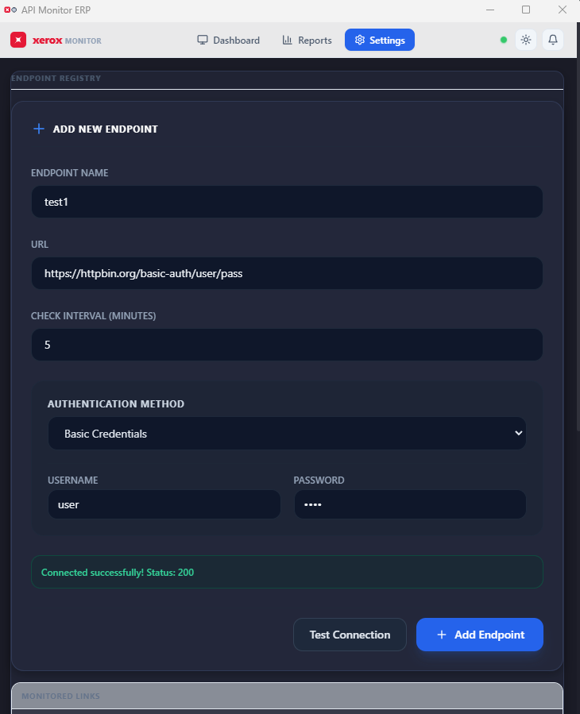
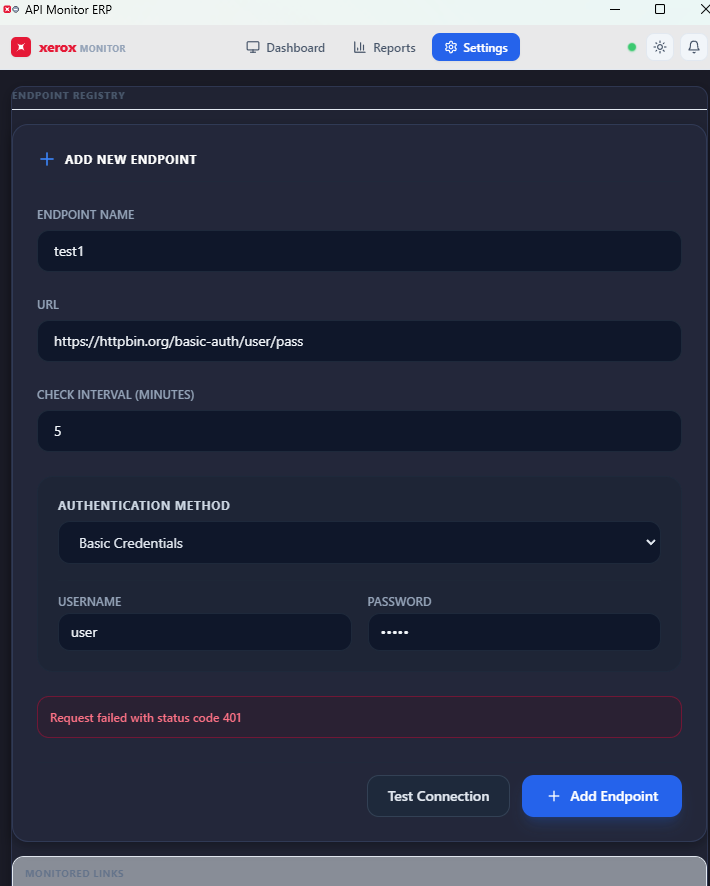
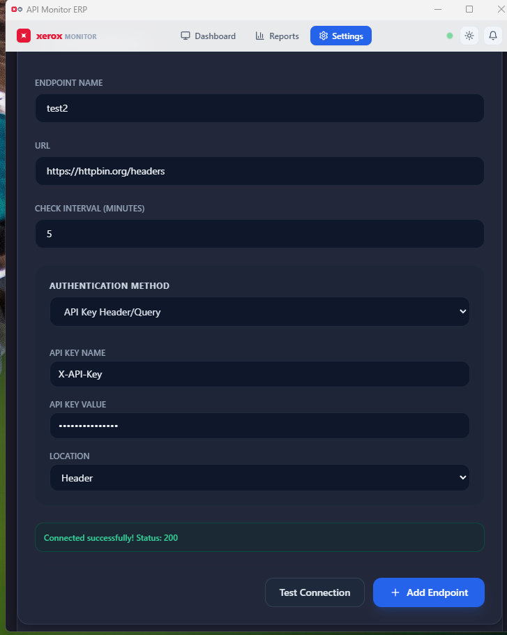
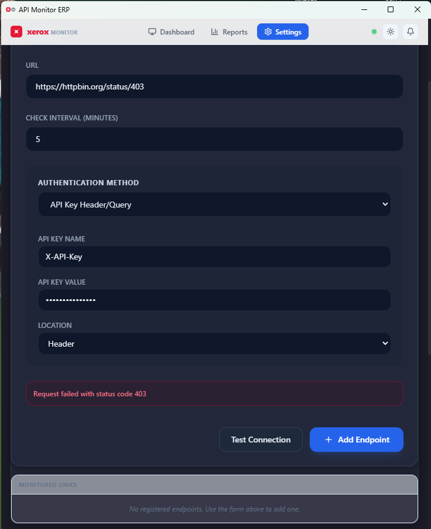
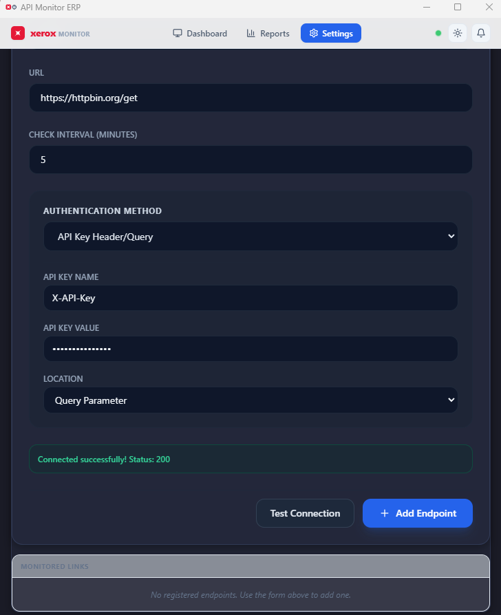
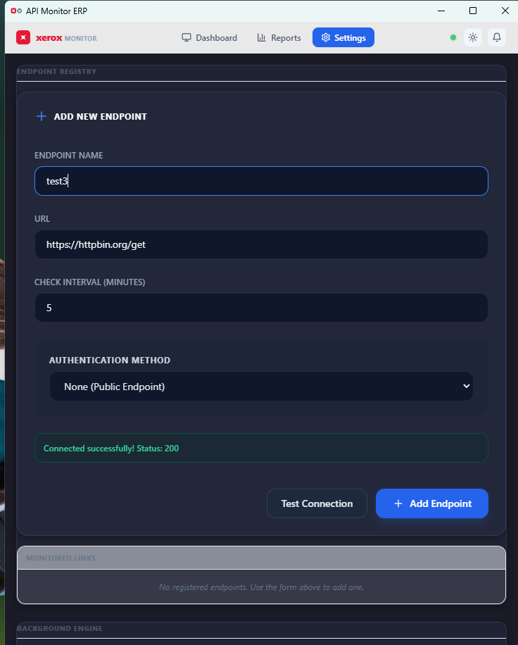

# Xerox API Monitor ERP

A lightweight, enterprise-ready desktop application dedicated exclusively to **HTTP/HTTPS API endpoint monitoring**, built using **Electron**, **React**, **Vite**, and **TypeScript**.

Designed specifically to run 24/7 in the system tray, bypassing browser CORS issues to monitor internal ERP API endpoints, database APIs, and intranet-only microservices.

---

## 🚀 Key Features

* **Sleek Compact Window Layout**: Optimized for desktop utility with a compact `750x550` window size.
* **Corporate Xerox Branding**: Features the exact Xerox corporate logo emblem (red rounded square with rotated white star) and custom brand typography.
* **Horizontal Navigation Cockpit**: Reorganized into a clean three-tab layout:
  * **Dashboard (Status Only)**: Minimal StatCards (Total, Online, Offline, Alerts), endpoint status checklist, active alerts feed, and Xerox clipboard copy audit logs.
  * **Reports (Diagnostic Charts)**: Dedicated performance panel containing 10-point response time line charts (inline SVG) and Uptime health gauges.
  * **Settings (Configuration Center)**: Consolidated inputs for adding/removing endpoints, setting custom check intervals, native OS banner toggles, SMTP servers, Discord/Slack webhooks, and JSON data backup exports.
* **24/7 System Tray Operations**: 
  * Minimizes to tray automatically on close to prevent interruption.
  * Dynamically updates tooltips showing outage warnings (e.g. `Xerox API Monitor - Outages: 2 offline`).
  * Features a tray context menu for focusing the app, triggering manual checks, or quitting.
* **Direct Intranet Access**: Bypasses browser sandboxes and CORS limitations, allowing direct HTTP monitoring of local network addresses (`192.168.x.x`), loopbacks (`127.0.0.1`), and intranet servers.
* **Enterprise Authentication Suite**: Full active support for static API Keys (header/query), authentic Windows Auth (NTLM challenges via `axios-ntlm`), client certificates (mTLS), session cookies (automated cookie jar-based multi-step login flows), and OAuth2 Client Credentials (with token caching).
* **Pre-Save Connection Test**: Direct credential validation option inside the Add Endpoint form to verify settings before storing.
* **Self-Scheduling timeout loops**: Eliminates polling race conditions and request accumulation by using recursively queued timeouts rather than overlapping intervals.
* **Automated Log Rotation**: In-database cleanup policy purging transaction histories and alerts older than 7 days on startup to limit SQLite disk space usage.

---

## 🛡️ Reliability, Accuracy & Security Architecture

The application implements several advanced architectural patterns to ensure enterprise-grade monitoring stability:

* **Overlapping Check Mitigation (Race-Condition Free)**: Instead of using strict interval loops (`setInterval`) which stack outstanding requests when pings lag or time out, the monitoring engine uses a recursive, self-scheduling `setTimeout` pattern. A subsequent check is queued only *after* the previous request's lifecycle has completely settled, ensuring highly accurate latency logs and preventing server overload.
* **Stateful Enterprise Authentication**:
  * **OAuth2 Client Credentials**: Automatically handles bearer token retrieval, caching, and auto-refresh mechanisms before expiry.
  * **Session Cookie Authentication**: Features a cookie jar-based client that runs login flows, captures cookies, and persists session states across checks.
  * **Windows Auth (NTLM)**: Implements authentic challenge-response handshakes via `axios-ntlm`.
* **On-the-fly Verification (Pre-Save Connection Test)**: Users can validate endpoint connectivity and authentication credentials inside the creation form before committing changes to the local database, facilitating faster troubleshooting.
* **Auto-Pruning Log Rotation**: On every application startup, a background cleanup sweep runs to purge logs and alert records older than 7 days, capping SQLite database growth and maintaining low resource overhead.

---

## 🔍 Monitored Connection & API Errors

The background monitoring engine actively catches, categorizes, and logs over 30 API connection issues, including:
* **Network TCP Failures**: `ECONNREFUSED` (server port closed), `ETIMEDOUT` (connection timeout), `ENOTFOUND` (DNS / VPN disconnected).
* **SSL/TLS Certificate Rejections**: `CERT_HAS_EXPIRED` (expired credentials), `DEPTH_ZERO_SELF_SIGNED_CERT` (self-signed blocks), and mTLS handshake mismatched keys.
* **HTTP Client Errors (4xx)**: `401 Unauthorized` (expired bearer tokens, missing credentials, failed NTLM), `403 Forbidden` (privilege restrictions), and `404 Not Found`.
* **HTTP Server Exceptions (5xx)**: `500 Internal Server Error` (backend crash), `502 Bad Gateway` (proxy down), and `503 Service Unavailable`.

---

## 🛠️ Tech Stack

* **Frontend**: React 18, TypeScript, TailwindCSS (Tokyo Night & Clear themes), Lucide Icons
* **Runtime / Shell**: Electron 28+, `electron-store` (Preferences), `electron-safe-storage` (Credentials encryption)
* **Build System**: `electron-vite`, `vite`
* **Local Database**: `better-sqlite3` (with `electron-store` fallback)
* **HTTP Client**: `axios`, `axios-ntlm`, `axios-cookiejar-support`

---

## 📁 Repository Layout

```text
API_Monitor/
├── electron/
│   ├── main.ts             # Main process setup, Tray loop & IPC Handlers
│   ├── preload.ts          # IPC Secure Context Bridge mapping
│   ├── database.ts         # Database wrapper with SQLite/Store fallback
│   └── monitoring.ts       # 24/7 Background HTTP(S) checking service loop
├── src/
│   ├── components/         # Core UI layouts and dashboards
│   │   ├── ui/             # Reusable UI widgets
│   │   │   ├── Spinner.tsx  # Loading spinner animation
│   │   │   ├── Skeleton.tsx # Loading skeleton block
│   │   │   └── UptimeChart.tsx # SVG response time graph & health gauge
│   │   ├── Layout.tsx      # Top horizontal navbar layout
│   │   ├── StatsCards.tsx  # KPI summary metrics cards
│   │   ├── Dashboard.tsx   # Dashboard status cockpit
│   │   ├── Settings.tsx    # Configuration center (forms, auth, backup)
│   │   ├── Reports.tsx     # Latency graphs mapping page
│   │   └── XeroxLogs.tsx   # Audit clipboard records
│   ├── context/            # React Global Providers
│   │   ├── ToastContext.tsx # Toast Stacking manager Provider
│   │   └── MonitoringContext.tsx # Central Reducer State Provider
│   ├── types/
│   │   └── index.ts        # TypeScript contracts (Endpoint, Auth, Logs)
│   ├── App.tsx             # Application wrapper
│   ├── index.css           # CSS entry, variables, and Tokyo Night themes
│   └── main.tsx            # Renderer entry point
```

---

## 📷 Visual Walkthrough & System Tray States

The following screenshots illustrate the layout and tray behavior options of the application:

### Taskbar Navigation & Default Electron Frame


*Shows the standard Windows OS Jump list for the active taskbar window button.*

### Active Application Settings View


*The main application interface displaying the settings tab with endpoint registration, check interval settings, notifications, and the Test Connection button.*

### Endpoint Authentication Configuration


*The settings panel showing the dropdown list of supported enterprise authentication methods, including API Key, Windows NTLM, mTLS Client Certificate, OAuth2, and Session Cookies.*

### System Tray Icons Caret


*The Windows taskbar caret (`^`) where background-monitored tray processes reside.*

### Expanded Tray Applications Pop-up


*The expanded Windows notification tray displaying all active background items.*

### Tray Context Menu Controls


*The custom right-click options displayed on the Xerox tray icon, exposing status details and exit controls.*

## 🧪 Manual Verification & Integration Tests

The application's connection testing and authentication pipelines were thoroughly validated through 6 core manual integration test cases executed against public test endpoints:

1. **Basic Authentication Success**
   * **Target Endpoint**: `https://httpbin.org/basic-auth/user/pass`
   * **Credentials**: Username `user`, Password `pass`
   * **Result**: **Success (200 OK)** — Injecting the base64-encoded standard Basic header yields a verified response.
   
   

2. **Basic Authentication Rejection**
   * **Target Endpoint**: `https://httpbin.org/basic-auth/user/pass`
   * **Credentials**: Username `user`, Password `wrong`
   * **Result**: **Failed (401 Unauthorized)** — The system correctly catches the authentication rejection.

   

3. **API Key Header Success**
   * **Target Endpoint**: `https://httpbin.org/headers`
   * **Config**: Key name `X-API-Key`, Value `my-secure-token`, Location `Header`
   * **Result**: **Success (200 OK)** — Header keys are correctly injected and echoed by the host.

   

4. **API Key Header Rejection**
   * **Target Endpoint**: `https://httpbin.org/status/403`
   * **Config**: Key name `X-API-Key`, Value `my-secure-token`, Location `Header`
   * **Result**: **Failed (403 Forbidden)** — Proves the app captures HTTP client/permissions rejections correctly.

   

5. **API Key Query Parameter Success**
   * **Target Endpoint**: `https://httpbin.org/get`
   * **Config**: Key name `api_key`, Value `my-query-token`, Location `Query Parameter`
   * **Result**: **Success (200 OK)** — Confirms parameters are successfully appended to URLs.

   

6. **Public Endpoint (No Auth) Success**
   * **Target Endpoint**: `https://httpbin.org/get`
   * **Config**: Authentication `None`
   * **Result**: **Success (200 OK)** — Connects seamlessly without credentials.

   

*(Visual logs and screenshots capturing these manual test events are recorded in [Doc1.docx](file:///c:/Users/Owner/Xerox/API_Monitor/Pictures/Doc1.docx))*

---

## ⚙️ Development Guide

### Prerequisites
Make sure you have Node.js (v18+) installed.

### Setup and Installation
1. Install project dependencies:
   ```bash
   npm install
   ```

2. Start the hot-reloading development environment:
   ```bash
   npm run dev
   ```

3. Compile and build the production bundles:
   ```bash
   npm run compile
   ```
