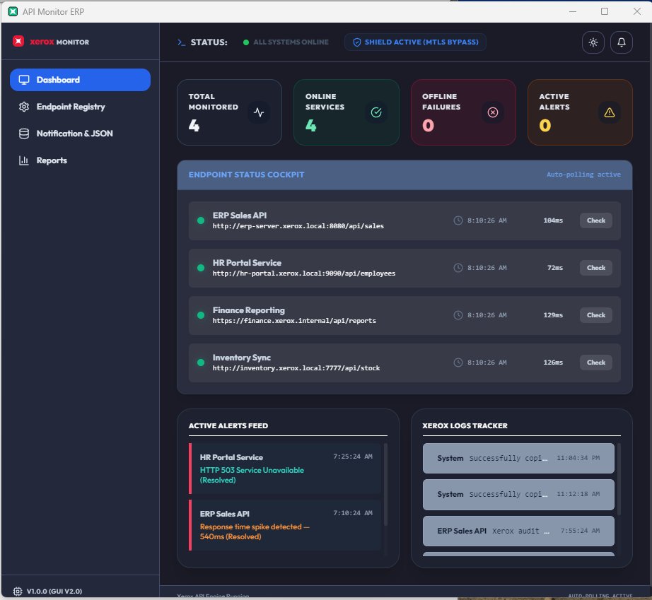

# Xerox API Monitor ERP Desktop

<div align="center">
  
</div>

| | |
|---|---|
| **Author** | Harry Joseph |
| **Version** | 1.0.0 |
| **Date** | July 8, 2026 |
| **Platform** | Windows (Electron Desktop App) |

A lightweight, enterprise-ready desktop application dedicated exclusively to **HTTP/HTTPS API endpoint monitoring**, built using **Electron**, **React**, **Vite**, **TypeScript**, and **Zustand**.

Designed specifically to run 24/7 in the system tray, bypassing browser CORS issues to monitor internal ERP API endpoints, database APIs, and intranet-only microservices.

---

## 🚀 Key Features

* **Sleek Compact Window Layout**: Optimized for desktop utility with a compact `750x550` window size.
* **Corporate Xerox Branding**: Features the exact Xerox corporate logo emblem (red rounded square with rotated white star) and custom brand typography.
* **Horizontal Navigation Cockpit**: Reorganized into a clean three-tab layout:
  * **Dashboard (Status Only)**: Minimal StatCards (Total, Online, Offline, Alerts), endpoint status checklist, active alerts feed, and Xerox clipboard copy audit logs.
  * **Reports (Diagnostic Charts)**: Dedicated performance panel containing 10-point response time line charts (inline SVG) and Uptime health gauges.
  * **Settings (Configuration Center)**: Consolidated inputs for adding/removing endpoints, setting custom check intervals, native OS banner toggles, real universal SMTP engine configuration (Host, Port, User, Pass) with connection testing, Discord/Slack webhooks, and JSON data backup exports.
* **24/7 System Tray Operations**: 
  * Minimizes to tray automatically on close to prevent interruption.
  * Dynamically updates tooltips showing outage warnings (e.g. `Xerox API Monitor - Outages: 2 offline`).
  * Features a tray context menu for focusing the app, triggering manual checks, or quitting.
* **Direct Intranet Access**: Bypasses browser sandboxes and CORS limitations, allowing direct HTTP monitoring of local network addresses (`192.168.x.x`), loopbacks (`127.0.0.1`), and intranet servers.
* **Enterprise Authentication Suite**: Full active support for static API Keys (header/query), authentic Windows Auth (NTLM challenges via `axios-ntlm`), client certificates (mTLS), session cookies (automated cookie jar-based multi-step login flows), and OAuth2 Client Credentials (with token caching).
* **Pre-Save Connection Test**: Direct credential validation option inside the Add Endpoint form to verify settings before storing.
* **Self-Scheduling timeout loops**: Eliminates polling race conditions and request accumulation by using recursively queued timeouts rather than overlapping intervals.
* **Demonstration Tools**: Embedded 1-click seeding utilities inside the Settings tab to inject live mock endpoints (healthy or mixed) to instantly test the UI and SMTP/Webhook alert dispatchers.
* **Automated Log Rotation**: In-database cleanup policy purging transaction histories and alerts older than 7 days on startup to limit SQLite disk space usage.

---

## 🛡️ Reliability, Accuracy & Security Architecture

The application implements several advanced architectural patterns to ensure enterprise-grade monitoring stability:

* **Strict Single-Instance Singleton**: Enforces a global OS-level single-instance lock to ensure only one background monitor runs at a time. This prevents duplicated tray icons, duplicated alerts, and concurrent SQLite database file corruption, even during local development.
* **Overlapping Check Mitigation (Race-Condition Free)**: Instead of using strict interval loops (`setInterval`) which stack outstanding requests when pings lag or time out, the monitoring engine uses a recursive, self-scheduling `setTimeout` pattern. A subsequent check is queued only *after* the previous request's lifecycle has completely settled, ensuring highly accurate latency logs and preventing server overload.
* **Stateful Enterprise Authentication**:
  * **OAuth2 Client Credentials**: Automatically handles bearer token retrieval, caching, and auto-refresh mechanisms before expiry.
  * **Session Cookie Authentication**: Features a cookie jar-based client that runs login flows, captures cookies, and persists session states across checks.
  * **Windows Auth (NTLM)**: Implements authentic challenge-response handshakes via `axios-ntlm`.
* **On-the-fly Verification (Pre-Save Connection Test)**: Users can validate endpoint connectivity and authentication credentials inside the creation form before committing changes to the local database, facilitating faster troubleshooting.
* **Universal Email Notifications Engine**: Native `nodemailer` integration allows real SMTP alert dispatches using any enterprise mail server (Gmail, Outlook, custom domains) with custom ports, credentials, and live UI configuration testing.
* **Auto-Pruning Log Rotation**: On every application startup, a background cleanup sweep runs to purge logs and alert records older than 7 days, capping SQLite database growth and maintaining low resource overhead.

---

## 💾 Database & Storage Paths
Because this application runs securely on your machine, no external databases are required. All endpoints, logs, and alerts are centralized in an isolated `AppData` folder on your machine:
* **Database**: `C:\Users\<Username>\AppData\Roaming\api-monitor-erp\api_monitor.db`
* **Settings**: `C:\Users\<Username>\AppData\Roaming\api-monitor-erp\config.json`

You can back up these files directly, or use the **Export Backup JSON** button inside the GUI to download everything instantly.

### Automated Log Exporting
For compliance purposes, you can enable **Weekly Auto-Export** in the settings. When enabled, the background service will automatically export a CSV file of all transaction logs to your specified directory every 7 days. This feature is fully disabled by default.

### Demo Data Injection
To test the application without real endpoints, you can manually inject mock endpoints by navigating to the Settings tab and using the **Seed Demo Data** button. This demo data is strictly manual and will not automatically reappear on startup once cleared.

---

## 🛠️ Enterprise Operations

### Launch at System Startup
To ensure 24/7 background monitoring without manual intervention, go to **Notification & JSON** settings and enable **Launch at System Startup**. The application will automatically boot directly to the system tray when Windows or macOS starts.

### Enable Electron Seamless Auto-Updates
When this is enabled, the background service will periodically check GitHub for new versions of the application. If a new release is found, it will automatically download and install it in the background to ensure your team is always running the latest patches.

### Maintenance Mode (Global Pause)
During planned ERP downtime or network upgrades, you can toggle **Enable Maintenance Mode** in the settings. This instantly pauses all outbound HTTP requests and alert notifications while keeping the application running. The system tray icon will turn grey to indicate it is sleeping.

---

## 🔍 Monitored Connection & API Errors

The background monitoring engine actively catches, categorizes, and logs over 30 API connection issues, including:
* **Network TCP Failures**: `ECONNREFUSED` (server port closed), `ETIMEDOUT` (connection timeout), `ENOTFOUND` (DNS / VPN disconnected).
* **SSL/TLS Certificate Rejections**: `CERT_HAS_EXPIRED` (expired credentials), `DEPTH_ZERO_SELF_SIGNED_CERT` (self-signed blocks), and mTLS handshake mismatched keys.
* **HTTP Client Errors (4xx)**: `401 Unauthorized` (expired bearer tokens, missing credentials, failed NTLM), `403 Forbidden` (privilege restrictions), and `404 Not Found`.
* **HTTP Server Exceptions (5xx)**: `500 Internal Server Error` (backend crash), `502 Bad Gateway` (proxy down), and `503 Service Unavailable`.

---

## 🛠️ Tech Stack

* **Frontend**: React 18, TypeScript, TailwindCSS (Tokyo Night & Clear themes), Zustand (Atomic Store), Lucide Icons
* **Runtime / Shell**: Electron 28+, `electron-store` (Preferences), `electron-safe-storage` (Credentials encryption)
* **Build System**: `electron-vite`, `vite`
* **Local Database**: `better-sqlite3` (with `electron-store` fallback)
* **HTTP Client**: `axios`, `axios-ntlm`, `axios-cookiejar-support`

### Why Zustand?
Zustand is utilized as our global atomic store to completely decouple state updates from the React component tree hierarchy. Since our UI rapidly syncs with the background monitoring engine via IPC (Inter-Process Communication) to capture real-time latency changes, using a traditional React Context provider would cause the entire application to constantly re-render, creating noticeable UI lag. Zustand allows our latency charts and status badges to subscribe specifically to atomic state slices, maintaining a lightning-fast UI regardless of the configured ping intervals or background polling volume.

---

## 📁 Repository Layout

```text
API_Monitor/
├── electron/
│   ├── main.ts             # Main process entry, auto-updater, tray loop & IPC handlers
│   ├── preload.ts          # Secure context bridge mapping exposed to the renderer
│   ├── database.ts         # SQLite wrapper, log rotation & credential encryption
│   └── monitoring.ts       # 24/7 background engine, deduplication cache & alerts
├── src/
│   ├── components/
│   │   ├── ui/
│   │   │   └── UptimeChart.tsx  # SVG latency sparkline & health gauge
│   │   ├── auth/
│   │   │   └── AuthConfigurator.tsx # Multi-Auth method selector and credentials UI
│   │   ├── Layout.tsx           # App shell — sidebar nav & header bar
│   │   ├── Dashboard.tsx        # Status cockpit with stats, endpoint list, feeds
│   │   ├── Settings.tsx         # Endpoint registry and core database config
│   │   ├── AddEndpointForm.tsx  # New endpoint creation form with connection test
│   │   ├── Reports.tsx          # Per-endpoint latency chart report page
│   │   └── NotificationJson.tsx # Enterprise Settings (Auto-start, Updates, Maintenance), SMTP, Webhooks
│   ├── store/
│   │   └── monitoringStore.ts    # Global Zustand atomic store synced from Electron main
│   ├── context/
│   │   └── ToastContext.tsx      # Toast notification provider and display logic
│   ├── types/
│   │   └── index.ts             # Shared TypeScript types (Endpoint, Alert, Log, AuthConfig)
│   ├── App.tsx                  # Root component and tab router
│   ├── index.css                # CSS variables, theme tokens, and global utilities
│   └── main.tsx                 # Renderer process entry point
```

---

## 📷 Visual Walkthrough & System Tray States

The following screenshots illustrate the layout and tray behavior options of the application:

### Taskbar Navigation & Default Electron Frame



*Shows the standard Windows OS Jump list for the active taskbar window button.*

### Active Application Settings View


*The main application interface displaying the settings tab with endpoint registration, check interval settings, notifications, and the Test Connection button.*

### Endpoint Authentication Configuration


*The settings panel showing the dropdown list of supported enterprise authentication methods, including API Key, Windows NTLM, mTLS Client Certificate, OAuth2, and Session Cookies.*

### System Tray Icons Caret


*The Windows taskbar caret (`^`) where background-monitored tray processes reside.*

### Expanded Tray Applications Pop-up


*The expanded Windows notification tray displaying all active background items.*

### Tray Context Menu Controls


*The custom right-click options displayed on the Xerox tray icon, exposing status details and exit controls.*

