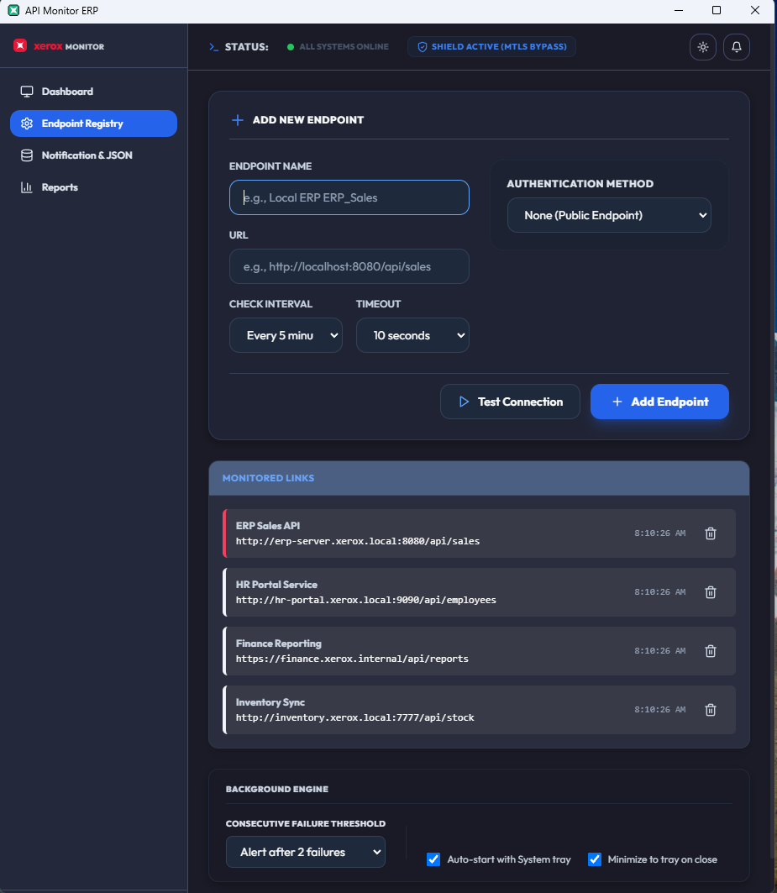
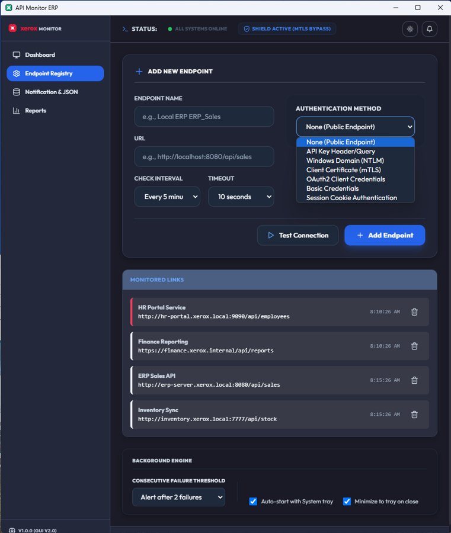
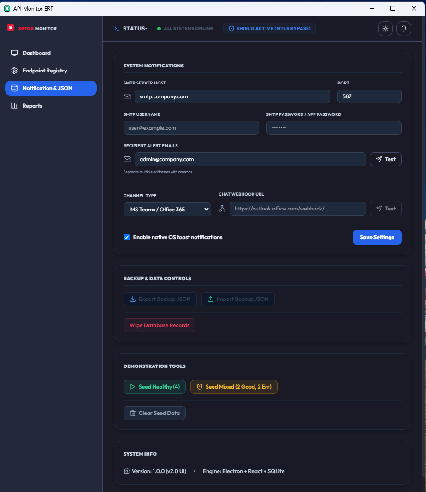
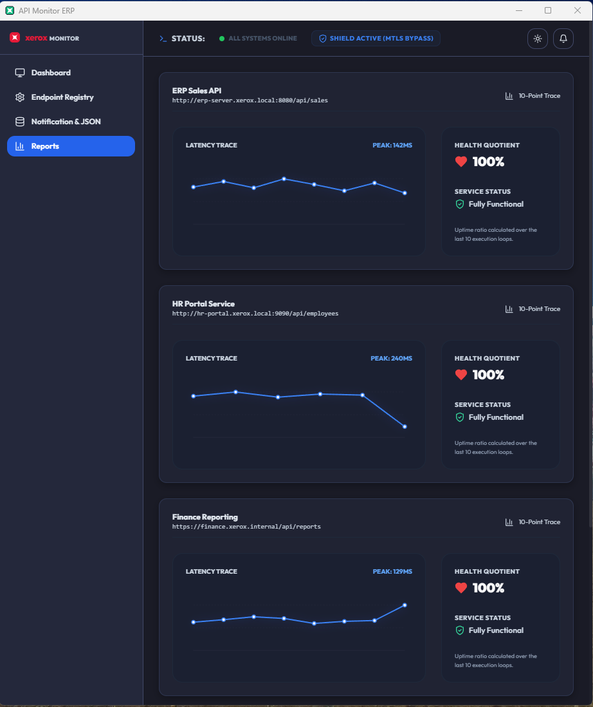
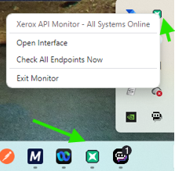

# Xerox API Monitor ERP — User Manual

  

| | |
|---|---|
| **Author** | Harry Joseph |
| **Version** | 1.0.0 |
| **Date** | July 9, 2026 |
| **Audience** | System Administrators, IT Operators, Integrators & Automation Engineers |

Welcome to the **Xerox API Monitor ERP** user manual. This guide is designed to help system administrators, IT operators, integrators, and automation engineers configure, monitor, and maintain corporate ERP API connections using the desktop application.

---

## Table of Contents
1. [Overview](#1-overview)
2. [Dashboard Navigation](#2-dashboard-navigation)
3. [Registering & Configuring Endpoints](#3-registering--configuring-endpoints)
4. [Authentication Guide](#4-authentication-guide)
5. [Configuring Chat Alerts & Webhooks (Teams/Discord/Slack)](#5-configuring-chat-alerts--webhooks)
6. [SMTP Email & Native Toast Alerts](#6-smtp-email--native-toast-alerts)
7. [Database Backup & Recovery](#7-database-backup--recovery)
8. [System Tray & Background Operations](#8-system-tray--background-operations)

---

## 1. Overview
The Xerox API Monitor ERP is a lightweight desktop utility designed to monitor internal and external ERP service links. The application runs a background service that continuously verifies connection uptime, response latencies, and service integrity.

### Performance Architecture
Under the hood, the user interface relies on a **Zustand Atomic Store**. This architectural choice ensures that the application remains extremely responsive and consumes minimal CPU. By using an atomic store rather than traditional React Context, the high-frequency latency updates arriving from the background engine only re-render the specific charts and text fields that need to change, rather than redrawing the entire application every time a sync occurs.

---

## 2. Dashboard Navigation
When you launch the application, you are greeted by the **Dashboard**. 

* **Key Indicators (Top Cards)**:
  * **Total Endpoints**: The number of service URLs currently monitored.
  * **Online Services**: Active links returning successful responses.
  * **Offline Failures**: Number of links currently failing.
  * **Active Alerts**: Unread warning logs for offline endpoints.
* **Endpoint Status Cockpit**: Displays a real-time list of all monitored links, their status (Online/Offline), current response latency (ms), and last check timestamp.
* **Xerox Logs Tracker**: Scrollable audit trail showing the success and failure history of all background check events.

---

## 3. Registering & Configuring Endpoints
To start monitoring a new URL:

1. Click the **Settings** tab in the main header.
2. Under **Endpoint Registry**, click **Add New Endpoint** to expand the form.
3. Fill in the parameters:
   * **Endpoint Name**: A friendly identifier (e.g., `Sales_Database_API`).
   * **URL**: The API web address (e.g., `https://api.company.com/v1/sales`).
   * **Check Interval (Minutes)**: How often the background service tests this link (default is 5 minutes).
4. Configure the required **Authentication Method** (see Section 4).
5. *(For intranet/internal HTTPS endpoints only)* If your server uses a self-signed or internally-issued certificate, check **"Accept self-signed / internal TLS certificates"**. Leave this unchecked for all public or externally-trusted HTTPS endpoints — SSL validation is enforced by default.
6. Click **Test Connection** to execute a test before saving. If successful, you will see a green check banner.
7. Click **+ Add Endpoint** to save and activate monitoring.

*(The Settings Panel showing the endpoint configuration inputs and the pre-save Test Connection option)*

---

## 4. Authentication Guide
The application supports multiple security layers. Under the **Authentication Method** dropdown, select the protocol required by your target server:

*(Supported enterprise authentication methods dropdown list)*

### A. None (Public Endpoint)
* **Use Case**: Public websites, unauthenticated internal status pages.
* **Config**: No credentials required.

### B. Basic Credentials
* **Use Case**: Standard username/password protection.
* **Config**:
  * **Username**: Your login ID.
  * **Password**: Your login password.

### C. API Key Header/Query
* **Use Case**: REST APIs requiring static developer keys.
* **Config**:
  * **API Key Name**: The key header/query name (e.g., `X-API-Key` or `Authorization`).
  * **API Key Value**: Your private token value.
  * **Location**: Select `Header` (sent invisibly in request headers) or `Query Parameter` (appended to the end of the URL like `?api_key=value`).

### D. Windows Domain (NTLM)
* **Use Case**: Internal corporate portals protected by Microsoft Active Directory.
* **Config**:
  * **Username / Password**: Your AD credentials.
  * **Domain**: Your Active Directory domain name.
  * **Workstation** *(Optional)*: Your local workstation name.

### E. OAuth2 Client Credentials
* **Use Case**: Modern microservices returning short-lived Bearer tokens.
* **Config**:
  * **Token URL**: The token generation address.
  * **Client ID**: Your app client identifier.
  * **Client Secret**: Your application password.
  * *Note: The application automatically handles fetching, caching, and renewing the transient Bearer token.*

### F. Session Cookie Authentication
* **Use Case**: Portals requiring a preliminary POST request login to retrieve a session cookie.
* **Config**:
  * **Login URL**: The page where credentials are submitted.
  * **JSON Payload**: The credentials payload format (e.g., `{"username": "admin", "password": "123"}`).
  * **Cookie Name**: The specific session cookie key to capture (e.g., `PHPSESSID` or `connect.sid`).

---

## 5. Configuring Chat Alerts & Webhooks
To push real-time failure alerts directly to your team's chat rooms:

1. Click the **Notification & JSON** tab.
2. Under **System Notifications**, locate the **Chat Webhook URL** field.
3. Paste the incoming webhook link generated by your chat provider:
   * **Microsoft Teams**: Create an *Incoming Webhook* connector inside your Teams channel and copy the `office.com` URL.
   * **Discord**: Go to Channel Settings ➔ Integrations ➔ Webhooks ➔ Copy Webhook URL.
   * **Slack**: Add the *Incoming Webhooks* app to your Slack workspace and copy the generated webhook URL.
4. When a monitored link goes offline, an detailed warning card is automatically posted to your channel.

---

## 6. SMTP Email & Native Toast Alerts
* **Configuring Real SMTP Emails**: To receive actual email dispatches when endpoints fail, you must configure a real mail server in the **Notification & JSON** tab under **SMTP Settings**. Provide your mail server host (e.g., `smtp.company.com`), port (e.g., `587`), and any necessary SMTP username and password credentials.
* **Recipient Alert Emails**: Enter comma-separated destination email addresses (e.g., `admin@company.com, alerts@company.com`) in the notification settings. The background engine will securely connect to your SMTP server and dispatch real HTML-formatted email alerts to these recipients immediately when an endpoint drops offline.
* **Native OS Toast Banners**: Toggle the *"Enable native OS toast banners"* checkbox. When checked, standard Windows slide-in alert notifications will display on your screen the instant a monitored endpoint status changes.

---

## 7. Database Backup & Recovery

Because this application uses native system APIs, all of your configurations, logs, and alerts are securely centralized in a predictable location on your machine.

### A. Raw Storage Paths (Windows)
If you wish to copy your raw database files directly to a USB drive or secondary server, navigate to the isolated `AppData\Roaming` folder for your Windows user profile (e.g., `C:\Users\Administrator\AppData\Roaming\api-monitor-erp\`).
* **The SQLite Database**: `api_monitor.db` (Contains all endpoints, historical ping logs, and alert records)
* **The Configuration File**: `config.json` (Contains your SMTP credentials, Webhook URLs, and UI toggles)

### B. GUI Export & Backup (Recommended)
You do not need to hunt through hidden Windows folders to back up your data. Under the **Backup & Data Controls** section of the **Notification & JSON** tab:

* **Export Backup JSON**: Click this button to save your entire configuration (all registered endpoints, historical logs, and custom system settings) as a single local `.json` file.
* **Import Backup JSON**: Click this button to upload a previously saved backup file. This will restore all your endpoints and system configurations instantly.
* **Wipe Database Records**: Click this to securely clear all endpoints, alert histories, and logs from your database, resetting the application to a clean slate.

### C. Extracting Logs
If you simply want to export your log history for reporting purposes:
1. Go to the **Dashboard** tab and scroll down to **Xerox Logs**.
2. Click **[ Download CSV ]** or **[ Download JSON ]** to instantly save the formatted logs straight to your Desktop or Documents folder.

### D. Automated Log Exporting
If your organization requires weekly compliance logs:
1. Go to the **Notification & JSON** tab.
2. Check the box for **Enable Weekly Auto-Export (CSV)**.
3. Provide a valid folder path (e.g., `C:\Logs` or `\\Server\Shared\Logs`).
4. The background service will automatically drop a new CSV file containing the week's logs into that folder every 7 days. This feature is disabled by default to prevent clutter.

### D. Demo Data Testing
If you would like to test the application interface without configuring real endpoints:
1. Go to the **Notification & JSON** tab and locate the **Backup & Data Controls** section.
2. Click **[ Seed Demo Data ]** to populate the dashboard with test configurations. 
3. *Note: Demo data injection is strictly manual. It will not be restored automatically upon application restart if you choose to clear it using the UI.*

---

## 8. System Tray & Background Operations
The application is designed to run 24/7 in the background without cluttering your desktop space. Powered by a high-performance Zustand atomic store, the UI efficiently synchronizes with the background engine without lag.

* **Minimize on Close**: Clicking the `X` (close window) button automatically hides the app into your Windows system tray.
* **Launch at Startup**: You can enable **Launch at System Startup** in the **Notification & JSON** settings so the monitor starts immediately upon boot.
* **Auto-Updates**: You can toggle **Enable Electron Seamless Auto-Updates** to automatically pull and install the latest versions from GitHub.
* **Maintenance Mode**: If your company is performing scheduled network upgrades, enable **Maintenance Mode** in the settings. This turns the tray icon grey and pauses all outbound network checks and email alerts until disabled.
* **Outage Tooltips**: Hovering over the Xerox system tray icon displays the current number of offline outages.
* **Tray Context Menu**: Right-clicking the tray icon exposes options to focus the window, run an on-demand check, or quit.

### Visual Guide:

#### System Notifications & Enterprise Settings:

#### Expanded Notification Icons:

#### Right-Click Context Menu controls:

---
